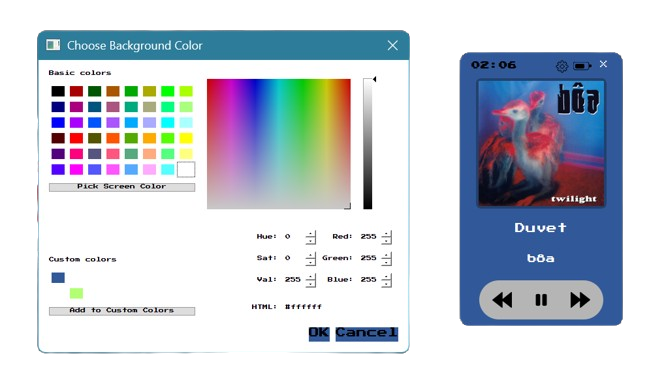
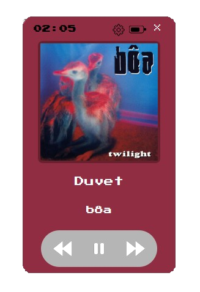

---

## 🎵 Spoopify — Minimal Spotify Desktop Widget

Spoopify is a lightweight, always-on-top Spotify desktop widget that displays the currently playing track, album art, and provides quick media controls — all in a retro 8-bit style.


---

### 🎵 Features

✅ **Real-time Spotify Sync**
Shows the current song, artist, and album art by polling Spotify playback every second.

✅ **Media Controls**
Includes **Play**, **Pause**, **Next**, and **Previous** buttons.

✅ **Always on Top**
The widget stays above other windows so it's always visible but on it turns invisible when not interacted with.

✅ **Font Customization**
Uses a custom 8-bit style font (`PressStart2P.ttf`) for retro vibes.

✅ **Draggable + Docking**
You can **drag the widget anywhere** on your screen.
Press **Ctrl + Right Click** to *dock it to the edge* of your screen for a cleaner look.






---

### 🧰 Requirements

Install runtime dependencies with:

```bash
pip install -r requirements.txt
```

---

### 🧪 Running the App

#### 🐍 From Python:

1. Create a `.env` file in your root directory:

   ### Spotify API Setup
   
   To use the widget, create an app at [Spotify Developer Dashboard](https://developer.spotify.com/dashboard) and get your **Client ID**, **Client Secret**, and set the redirect URI to:
   
   ```
   http://localhost:8888/callback
   ```
   
   Then create a `.env` file in the root with:
   
   ```env
   SPOTIPY_CLIENT_ID=your_client_id
   SPOTIPY_CLIENT_SECRET=your_client_secret
   SPOTIPY_REDIRECT_URI=http://localhost:8888/callback
   ```
---

2. Run it:

   ```bash
   python main.py
   ```
---

### 🧠 Credits

* Built using **Spotipy** and **PyQt5**

---

